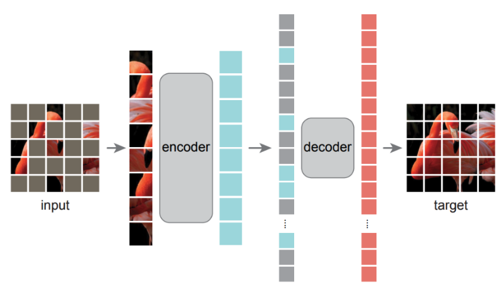
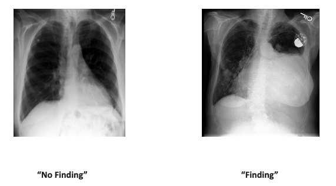

# Implementation of Masked Autoencoders Vision Learners on Medical Chest X-Ray Images


In this work, we aim to evaluate the potential of the [Masked Autoencoder Vision Learners(MAE ViT)](https://arxiv.org/abs/2111.06377) applied to chest X-ray images and compare it to CNNs on the [MIMIC dataset](https://physionet.org/content/mimic-cxr-jpg/2.0.0/)
This repository contains the code implementation.


## Table of Contents

- [MAE ViT](#mae-vit)
- [MIMIC Dataset](#mimic-dataset)
- [Results](#results)
- [Configurations](#configurations)
- [How to run?] (#How to run?)

## MAE ViT
<br>

The [Masked Autoencoder Vision Learners(MAE ViT)](https://arxiv.org/abs/2111.06377) model is a transformer-based model that uses a masked autoencoder as a pretraining task.

<p align="center">
    
</p>

You can find the original implementation of the MAE ViT [here](https://github.com/facebookresearch/mae), or as we did, use the model weights from HuggingFace's [transformers](https://huggingface.co/facebook/vit-mae-base).

## MIMIC Dataset
The [MIMIC Chest X-ray JPG (MIMIC-CXR-JPG) Database v2.0.0](https://physionet.org/content/mimic-cxr-jpg/2.0.0/) is a large publicly available dataset of chest radiographs in JPG format with structured labels derived from free-text radiology reports.
This dataset is multi-label, multi-class. In this work, we create a binary classification task, where we classify the images as either normal or abnormal.

<p align="center">
    
</p>

## Results

### Sample size 10,000:
| Model   | augmentation  | % Masking | Accuracy | Precision | F1    | Recall | AUC   |
|---------|---------------|-----------|----------|-----------|-------|--------|-------|
| MAE ViT | augmented     | 0.25      | 0.749    | 0.738     | 0.803 | **0.882**  | 0.809 |
| MAE ViT | augmented     | 0.50      | 0.747    | 0.729     | 0.805 | 0.899  | 0.796 |
| MAE ViT | augmented     | 0.75      | **0.750**    | **0.737**     |**0.805** | 0.888  | 0.799 |
| MAE ViT | not augmented | -       | 0.755    | 0.775     | 0.795 | 0.817  | **0.802** |
| ResNet  | augmented     | -         | 0.750    | 0.755     | 0.797 | 0.844  | 0.807 |
| ResNet  | not augmented | -       | 0.743    | 0.759     | 0.788 | 0.819  | 0.780 |

## Configurations
1. Get the mimic dataset and set `MIMIC_FILES_PATH` to the root folder of the dataset, in the `config.py` file.

## How to run?
1. Create a Python environment. We used poetry, but you can use any other tool. There is also a `requirements.txt` file in the root folder.
2. Activate the environment and run 
```bash
python <path/to/experiments_runner.py> --model "facebook/vit-mae-base" --transformer "mae_with_augmentation_prob_050"
```
If you want to see what params you can use, look at: `experiments_runner.py`
